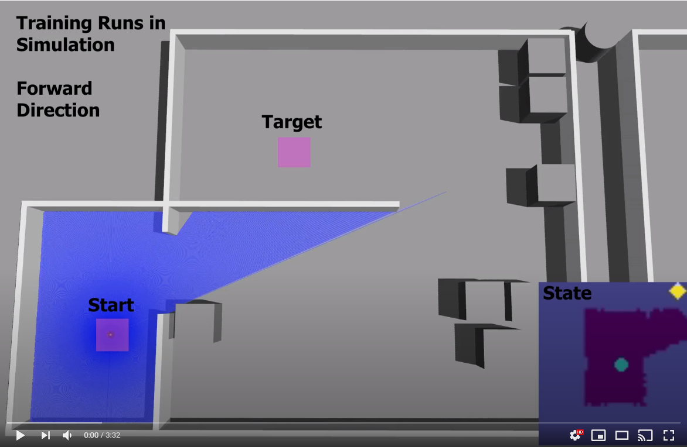

# Maples Navigation: A reinforcement learning approach

**Abstract:**  
Autonomous navigation from A to B in indoor environments is a widely researched field.  However, many known approaches are based on a mapping of the entire environment in order to be able to calculate a path through this space in advance. In this Master thesis, a new approach based on reinforcement learning is proposed. With this scheme, a complete mapping of the environment is not necessary, as it depends only on current laser scan values and the position relative to the target. The method has been developed using the Robot Operating System (ROS) and Gazebo for simulation. A test vehicle with Ackermann steering was built to test the proposed method and compared  with a state of the art navigation method in a real world scenario.
Experiments have shown that the proposed method does not reach the accuracy of the existing algorithm in terms of reliability to achieve the desired goal. However, the proposed method offers potential in cases where prior mapping is not possible.

**Navigation sample using a TEB based Planner as a baseline:**  

**Navigation sample using the proposed Reinforcement Learning Approach:**  

## Documentation:

Full Documentation: 

### Experiments:

| Experiment   | Description   | Video  |
| ------------- |:------| ----- |
| Exp. 1  |This experiment visually shows the trajectories chosen by the RL-Agent at different training steps regarding a given starting and target position.| |
| Exp. 2  |This experiment is used to determine the reliability of arriving at the target and the distribution of the distance to the target over the different runs in simulation regarding the RL-Agent. In TrainEnv-1 and ValEnv-1, 15 runs are made in the forward direction and 15 runs in backward direction.||
| Exp. 3  |asd||
| Exp. 4  |asd||
| Exp. 5  |asd||

## Training in Simulation

### Gym Environment

[navigation_env.py](ackerbot_sim_ws/src/rl-navigation/navigation_gym/navigation_env.py)  
[navigation_discrete_task.py](ackerbot_sim_ws/src/rl-navigation/navigation_gym/tasks/navigation_discrete_task.py)

## Test Vehicle

TODO

