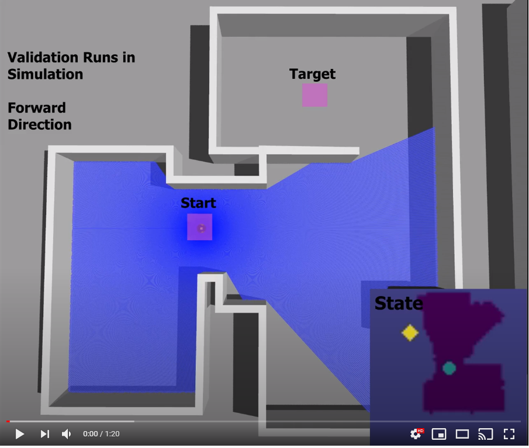
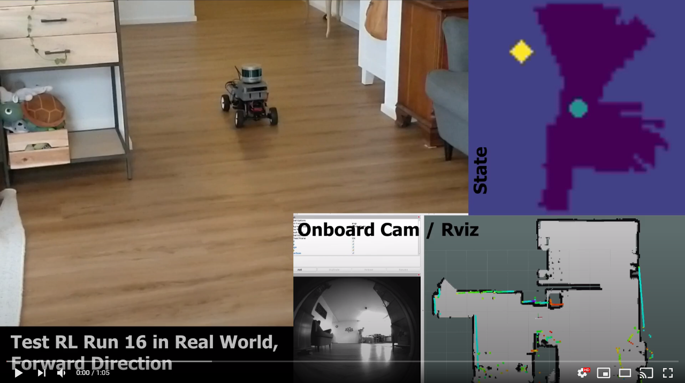
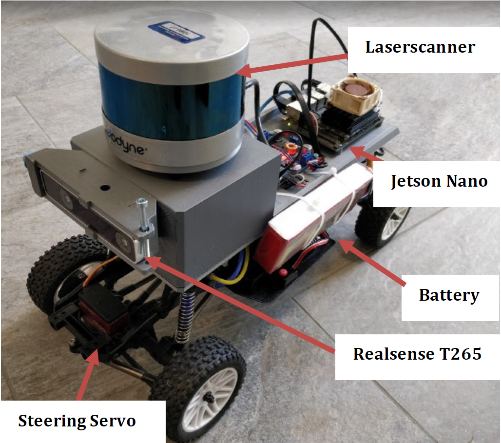

# Mapless Navigation: A reinforcement learning approach

**Abstract:**  
Autonomous navigation from A to B in indoor environments is a widely researched field. Many known approaches 
are based on a mapping of the entire environment in order to calculate a path through the space in advance. This 
Master thesis proposes a new approach based on reinforcement learning. It shows that a system can navigate by 
only using sensor data and system pose relative to a target. The method bases on the Robot Operating System 
(ROS) and Gazebo for simulation and training. A test vehicle with Ackermann steering was built to test the 
proposed method and compared with a state of the art navigation method in a real world scenario.
Evaluation experiments have shown that the proposed method is outperformed by SLAM based solutions, in terms 
of pose accuracy, location precision and the reliability of achieving the desired target. Though, the developed
procedure offers potential in cases where prior mapping is not possible and exploration capability of a vehicle is 
required.

## Documentation:

Full Documentation: **[Master Thesis](docs/SchoriDamianMasterThesis.pdf)**

### Videos:

|     **Training Process:**    |    **Trained Agent in Real-World:**        |
| ------------- |:-------------:|
|  |  |

|     **Navigation trajectories using a TEB based Planner as a baseline:**  |
| ------------- |
| |

|    **Navigation trajectories using the proposed Reinforcement Learning Approach:**  |
| ------------- |
| |

## Experiments:

| **Experiment**   | **Description**   | **Video**  |
| ------------- |:------| ----- |
| Exp. 1  |This experiment visually shows the trajectories chosen by the RL-Agent at different training steps regarding a given starting and target position.| |
| Exp. 2 Train |This experiment is used to determine the reliability of arriving at the target and the distribution of the distance to the target over the different runs in simulation regarding the RL-Agent. In TrainEnv-1 and ValEnv-1, 15 runs are made in the forward direction and 15 runs in backward direction.||
| Exp. 2 Val |This experiment is used to determine the reliability of arriving at the target and the distribution of the distance to the target over the different runs in simulation regarding the RL-Agent. In TrainEnv-1 and ValEnv-1, 15 runs are made in the forward direction and 15 runs in backward direction.||
| Exp. 3  |This experiment is used to determine the reliability of arriving at the target and the distribution of the distance to the target over the different runs in real world regarding the RL-Agent. In each case, 15 runs are made in the forward direction and 15 runs in backward direction.||
| Exp. 4  |This experiment serves as a baseline to the reliability of arriving at the target and the distribution of the distance to the target. The path is computed by the TEB algorithm. In each case, 15 runs are made in the forward direction and 15 runs in backward direction.||
| Test 1  |In this video, the mapping process of the testing environment is shown using the Google Cartographer tool.||
| Test 2  |This experiment is meant to show the capabilities of TEB Planner in path planning over longer distances and dynamic obstacle avoidance, two sample runs were recorded.||

## Training in Simulation

The simulated vehicle is based on the [MIT-Racecar Project](https://github.com/mit-racecar).   

### Setup

The python requirements are listed in: [requirements.txt](requirements.txt)  

To **start the training process** in simulation, do the following:  

1. Install ROS Noetic on Ubuntu 20.04 (other setup's may work but are not tested)
3. Clone this repository 
4. cd into the `Ackerbot/ackerbot_sim_ws/src` folder
5. Clone https://github.com/dschori/racecar_gazebo into the folder
6. Clone https://github.com/mit-racecar/racecar into the folder
8. cd back into the `Ackerbot/ackerbot_sim_ws` folder
7. Install missing ROS-Packages with: `rosdep install --from-paths src --ignore-src -r -y`
9. Build the workspace with `catkin build`
10. Source with `source devel/setup.bash`
11. Run the Gazebo Train Simulation with: `roslaunch racecar_gazebo racecar_rl_env_train.launch`
12. Open new Terminal in the same directory:
13. Source again with `source devel/setup.bash`
14. Start the training with: `roslaunch navigation_train train.launch`
15. To increase the training speed, one can change the `real time update` to 0 (as fast as possible) in Gazebo under World/Physics
16. Monitor the training statistics with [Tensorboard](https://www.tensorflow.org/tensorboard): `tensorboard --logdir ~/ray_results`, then go to http://localhost:6006/ to see the board

## Gym-Gazebo Environment

Gym-Gazebo Environment base: [navigation_env.py](ackerbot_sim_ws/src/rl-navigation/navigation_gym/src/navigation_gym/navigation_env.py)  
Discrete Task: [navigation_discrete_task.py](ackerbot_sim_ws/src/rl-navigation/navigation_gym/src/navigation_gym/tasks/navigation_discrete_task.py)  
Environment for test-vehicle: [navigation_env_testvehicle.py](ackerbot_sim_ws/src/rl-navigation/navigation_gym/src/navigation_gym/navigation_env_testvehicle.py)

## [Test Vehicle](ackerbot_real_ws/src/robot_pkg)

**see: [robot pkg](ackerbot_real_ws/src/robot_pkg)**

## Trained Agent

https://drive.switch.ch/index.php/s/ExPSxCnDNx5ivnb 
